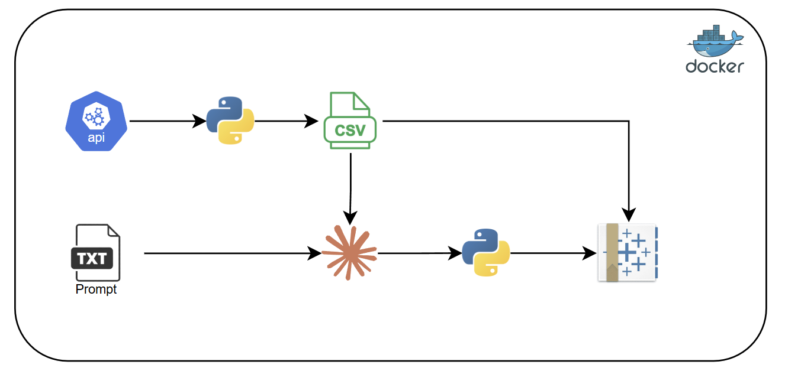

# NIS Forex Exchange Rate Dashboard


*Photo credit: ASAP Creative / Globes*

Automated pipeline that fetches daily NIS exchange rates and generates a Tableau dashboard from code.

## Background

The Israeli Shekel has undergone remarkable swings over the decades — from a period when the [Shekel-Dollar rate dipped below ₪3 to the dollar](https://en.globes.co.il/en/article-shekel-dollar-rate-dips-below-nis-3-1001540198) to the significant depreciation pressures seen more recently during periods of geopolitical uncertainty.

This project was built to make those long-run currency trends easy to explore. By combining decades of historical Bank of Israel data with a live daily update pipeline and a fully programmatically generated Tableau dashboard, it provides a single view across all major currencies traded against the NIS — with flexible time granularity, seasonality analysis, and volatility tracking.

## What it does

1. **Ingests** — `daily_rates_ingestion.py` pulls USD, GBP, JPY, EUR, and CHF rates against the Israeli Shekel from the [fawazahmed0 currency API](https://github.com/fawazahmed0/exchange-api) and appends them to `src/NIS_Exchange_Rates.csv`.
2. **Generates** — `generate_dashboard.py` builds a fully-specified `nis_forex_dashboard.twb` Tableau workbook programmatically from Python, with no manual Tableau steps required.

## Dashboard features

- KPI cards: Avg Rate, Period High, Period Low, Trading Days
- Main trend line (dual-axis line + area)
- Monthly seasonality and day-of-week pattern bars
- Volatility line (cumulative % change from period start)
- Period-over-period change bars
- Multi-currency comparison (all 5 currencies on one chart)
- Parameter controls: Currency Selector, Time Granularity (Day/Week/Month/Quarter/Year), Start Date, End Date

## Architecture



## Project structure

```
├── src/
│   └── NIS_Exchange_Rates.csv       # Historical exchange rate data
├── python/
│   └── Dockerfile                   # Python 3.11-slim + pandas/requests
├── daily_rates_ingestion.py         # Fetches and appends new rates to the CSV
├── generate_dashboard.py            # Generates nis_forex_dashboard.twb from scratch
├── nis_forex_dashboard.twb          # Generated Tableau workbook (open in Desktop)
├── prompt.txt                       # LLM prompt spec for the dashboard
├── docker-compose.yml               # Docker setup for the ingestion container
└── .env                             # Environment variables
```

## Setup

### Run ingestion locally

```bash
pip install requests pandas
python daily_rates_ingestion.py
```

### Run ingestion via Docker

```bash
docker compose up -d
```

The container runs `daily_rates_ingestion.py` on startup and automatically updates `src/NIS_Exchange_Rates.csv` with the latest rates. To trigger a manual update at any time:

```bash
docker exec python_runner python /app/daily_rates_ingestion.py
```

### Regenerate the Tableau workbook

```bash
python generate_dashboard.py
```

Then open `nis_forex_dashboard.twb` in Tableau Desktop and re-point the data source to `src/NIS_Exchange_Rates.csv` if prompted.

## Tableau AI Skill

The dashboard generation is powered by the **Tableau TWB skill** — a Claude Code skill that provides structured knowledge for generating Tableau workbook XML programmatically.

Skill created by [Tomer Moskov](https://github.com/TomerMoskov/tableau-ai-skill/tree/main/tableau-twb).

## Data source

Historical data was sourced from the [Bank of Israel exchange rate tables](https://www.boi.org.il/en/economic-roles/financial-markets/exchange-rates/).

Daily updates are fetched via the [fawazahmed0 currency API](https://github.com/fawazahmed0/exchange-api) — a free, open-source, CDN-delivered currency API with no key required.

Currencies tracked: USD, GBP, JPY (per 100), EUR, CHF — all quoted in NIS (₪).
